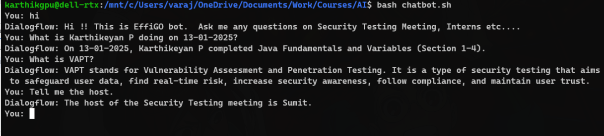

### Building a EffiGO ChatBot with GCP Dialogflow CX:

#### Build an Agent with Flows:
##### Flow Basics:
Source : `https://cloud.google.com/dialogflow/cx/docs/quick/build-agent`.
* **Agent** : NLP Model, acts like a human call center agent.
* **Flow**: 
	* Overall Design of the pages, intents, routes, and actions.
	* Represented using a *State Machine*.
	* Every Agent Has a `Default start flow`.
* **Pages**:
	* The Flow is represented using a State Machine, and each state is a **Page**.
	* So at any moment, only one page will be active.
	* Every Flow has a `start-page`.
* **Entity** : They define the type of data to retrieve during the conversation, like *types* in programming.
* **Parameters**: Store the values of *Entity* type.
* **Form** : Defines *list* of **Form Parameters** (Page Parameters) to be collected from the user for a specific page.
* **Intent** : Intention of the user. They contain
	* Display Name
	* Labels
	* Training Phrases : They are statements what type of input to be expected
	* Parameters and Entities.
	* DTMF Patterns : Dual Tone Multi Frequency - for telephone interactions through the number pad.
* **Webhook** : used to perform external actions like sending collected parameters, trigger actions in backend etc.
* **Fulfilment**: Action to perform/Response immediately after processing the user inputs. They could be:
	* Static Response
	* Webhook calls (dynamic Response)
	* Parameter value overriding.
	
* **State Handler**: The part that generates the main Response body. They have the three types of data:
	* Handler Requirements
	* Handler Fulfillment
	* Handler Transitional target : optional transitional target page to go to.
* Two types of State Handlers:
	* Routes : called when intent or condition matches
		* Intent Route
		* Condition Route
	* Event handlers: Handle unexpected event.
* *Three steps to process state handler*:
	* Scope 
	* Evaluation : of requirements
	* Call : If handler in scope and evaluation passed, then call the fulfilment and transitional target.
* **Regionalization and Location** : Keep Region near services and End-user. Cannot change location. 
* **Console**: *`Diagflow CX console`* to create, build and test agents.
* *Integrations*: with external API with Webhooks.

##### Things Done:
* Created The GCP Trial account.
* Created a project called `docu-help` in the Google Cloud Console.
* Uploaded the Documents into Google Cloud Datastore
* Created *Agent* with the Agent Builder Console, takes a while to be imported.
* Installed **gCloud** in WSL, with https://cloud.google.com/sdk/docs/install#linux
* Ran the command :
```sh
gcloud init
```
* Redirects to the browser, for authentication.
* Set the current project to `docu-help-449706`.
* Now we could generate the access token and use it in scripts with:
```
gcloud auth print-access-token
```
* In the DiagFlow Console, tested the application with only the starter Flow.
* Added more pages, with `intents routes`.
#### The Workflow:
* The Model Starts in the `Start Page`.
* It responds with a custom Greeting.
* When the agents see `greeting intent` like "hi","hello", etc,. it moves to the `Question Pages`.
* In `Question Page`, the user asks questions based on the data in the datastore.
* When User Enters "thank you", the current page becomes "end flow".
```
Start Page -> Question -> End Flow
```
* Now the model is complete, and created a Shell Script to Communicate with the agent -> `chatbot.sh`.
* Start the script with
```sh
bash chatbot.sh
```
* Now chat with the agent in terminal:


